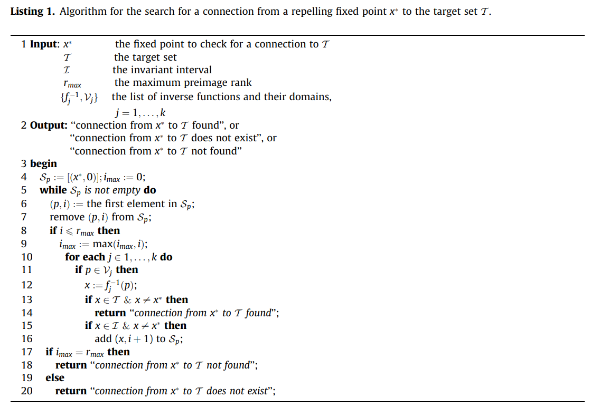
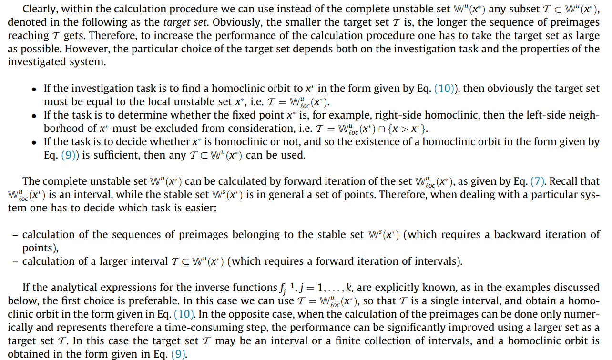

# AvrutinSearch.jl
A Julia implementation via interval arithmetic of the algorithm described in *Avrutin V et al. Calculation of homoclinic and heteroclinic orbits in 1D maps. Commun Nonlinear Sci Numer Simulat (2014), http://dx.doi.org/10.1016/j.cnsns.2014.07.008*.

# Usage

## Finding homoclinic orbits
The algorithm from the paper is given below:

Note that line 11 in the pseudocode above is incorrect; it should be **if $p \in f(V_j)$ then**.

You must supply $f$, $x^\*$, $\mathcal{T}\_0$, $\mathcal{I}$, $r\_{\max}$, and the additional parameter $n\_{\text{iter}}$ to the function `AvrutinSearch.homoclinic_to_equilibrium`.

- $f$ should be two vectors of `Float64` values each having the same length which, when `zip`ped together, have elements corresponding to pairs $(x, f(x))$.
  A linear interpolation of the supplied sample points is taken.
  In the future we may allow you to supply more general functions, but doing so requires far more computationally inefficient methods for computing iterates of the initial target interval $T_0$.
  
- $x^\*$ should be a `Float64` value. Make sure that this is a repelling fixed point of the map!
  The easiest way to check this is by representing $x^\*$ as a variable `x` and running `f(x) == x`; this should evaluate to `true`.

- $\mathcal{T}\_0$ is the initial target subset of $\mathbb{W}^u(x^\*)$ being searched for.
  Practically, $\mathcal{T}\_0$ is supplied as an `Interval` value and should contain $x^\*$.
  Some guidelines for selecting $\mathcal{T}\_0$ are given in the paper by Avrutin et al.:

  > 

- $\mathcal{I}$ is some closed bounded interval $[a, b]$ satisfying $x^\* \in \mathcal{I}$ and $f(\mathcal{I}) \subseteq \mathcal{I}$ (the paper assumes that $f(\mathcal{I}) = \mathcal{I}$, but this is unnecessary).
  In practice, this should be an `Interval` value.
  Currently, you do need to determine this interval by manual inspection of $f$; in the future we may implement an algorithm for determination of this interval.
  
  Note that $\mathcal{I}$ can and should be chosen to be as small as possible; as long as $\mathcal{I}$ satisfies the two aforementioned requirements, any points lying outside of $\mathcal{I}$ cannot be involved in homoclinic orbits.
  Moreover, there should be some positive integer $k$ such that for each $x \in \mathcal{I}$ the pre-image set $f|\_\mathcal{I}^{-1}(x)$ has at most $k$ many elements; otherwise the pre-image search tree may become intractibly broad.
  In particular, $f$ should have $k$ many interval ``branches'' $\mathcal{V}\_1, \dots, \mathcal{V}\_k$ in $\mathcal{I}$ on which its restriction is invertible.
  Because the function $f$ is reconstructed by linearly interpolating finitely many sample points of its graph, this branch limit is currently guaranteed.

- $\mathcal{r\_{\max}}$ should be a `UInt64` value.
  This is a maximal depth in the pre-image search tree.
  If $\mathcal{r\_{\max}}$ is zero, there will be no maximal rank of pre-image imposed (which is probably not the best idea).

- $n\_{\text{iter}}$ should be a `UInt64` value.
  This controls how many forward iterates of the initially supplied target interval $\mathcal{T}\_0$ are taken as a final target set $\mathcal{T}$.
  If zero, then no forward iterates are used; in this case $\mathcal{T} = \mathcal{T}\_0$.
  More iterates mean  less pre-image computation steps during search; this can drastically improve search time.

$\\{f\_j^{-1}, \mathcal{V}\_j\\}\_{j=1}^k$ is computed automatically.
We prune any $\mathcal{V}\_j$ which lies fully within $\mathcal{T}$.

## To Do

- Allow more general function suppliance (backlog).
- Automatically determine $\mathcal{T}\_0$ (likely this should just be the two points immediately surrounding $x^\*$ in the discrete sampling).
- Automatically determine $n\_iter$ and consequently $\mathcal{T}$ based on convergence.
- Automatically determine $I$.